# 🛠️ Developer Manual

> "The instruction manual for Clarity."

This document is the unified technical reference for running, maintaining, and deploying the Clarity codebase.

---

## 🏗️ System Architecture

Clarity follows a **Microservices** pattern, decoupling the heavy Inference Engine from the lightweight UI.

```mermaid
%%{init: {'theme': 'dark', 'themeVariables': { 'darkMode': true, 'primaryColor': '#1e1e2e', 'edgeLabelBackground':'#181825', 'tertiaryColor': '#181825', 'mainBkg': '#1e1e2e', 'nodeBorder': '#b4befe', 'lineColor': '#cdd6f4'}}}%%
graph TD
    subgraph Client [Frontend Layer]
        UI[Browser UI]
        Theme[Theme Engine]
        HLJS[Syntax Highlighter]
    end

    subgraph Server [Backend Layer]
        API[FastAPI Gateway]
        Detect[Lang Detection]
        Llama[llama.cpp Engine]
    end

    UI -->|JSON HTTP| API
    API -->|Raw Code| Detect
    API -->|Prompt| Llama
    Llama -->|Tokens| API
    
    style Client fill:#313244,stroke:#89b4fa,color:#cdd6f4
    style Server fill:#313244,stroke:#a6e3a1,color:#cdd6f4
    style UI fill:#45475a,stroke:#b4befe
    style API fill:#45475a,stroke:#94e2d5
    style Llama fill:#45475a,stroke:#f38ba8
```



### Core Systems
1.  **Inference Engine (`backend/model_service.py`):** Uses `llama-cpp-python` to run **Qwen 2.5 Coder 7B (GGUF)** on CPU with 4-bit quantization.
2.  **Frontend (`frontend/`):** Zero-build vanilla HTML/JS with a custom Catppuccin Theme Engine.
3.  **Discovery:** Auto-detects Local (`localhost:8000`), Docker (`7860`), or Cloud (`hf.space`) environments.

---

## 💻 Local Development

### Option A: The Docker Way (Recommended)
Guarantees an identical environment to production.

```bash
# Start the full stack
docker compose up --build
```
*   **Frontend:** [http://localhost](http://localhost)
*   **Backend:** Port 7860 (Internal)

### Option B: The Manual Way (Legacy)

**1. Start Backend:**
```bash
cd backend
python -m venv venv
source venv/bin/activate
pip install -r requirements.txt
uvicorn main:app --reload --port 8000
```

**2. Start Frontend:**
Serve `frontend/index.html` using any static server (e.g., Live Server or `python -m http.server 3000`).

---

## 🚀 Deployment Guide

### 1. Backend (Hugging Face Spaces)
*   **Platform:** Hugging Face Spaces (Docker SDK).
*   **Config:** `backend/Dockerfile` (Non-root user 1000).
*   **Process:** Upload `backend/` content to the Space root. HF builds the image automatically.

### 2. Frontend (Vercel)
*   **Platform:** Vercel (Static Site).
*   **Config:** Point Root Directory to `frontend/`.
*   **Connection:** The frontend logic in `script.js` contains the production URL hardcoded for the `CLOUD` mode.

---

## 🌿 Git Workflow & Contributing

### Branching Strategy
*   **`main`:** The "Golden Copy". Always deployable.
*   **`feature/*`:** New functionality.
*   **`fix/*`:** Corrective patches.

### The Pull Request Lifecycle
1.  **Open:** Create a PR when your feature is ready.
2.  **Review:** Team members review the code.
3.  **Merge:** Squash and merge into `main`.

---

## 🔗 See Also
*   [📖 The Clarity Journey](JOURNEY.md) - Why we built it this way (Troubleshooting & Decisions).
*   [🤖 AI Manifesto](docs/AI_MANIFESTO.md) - The rules governing the model's behavior.

[⬅️ Back to Home](README.md)
