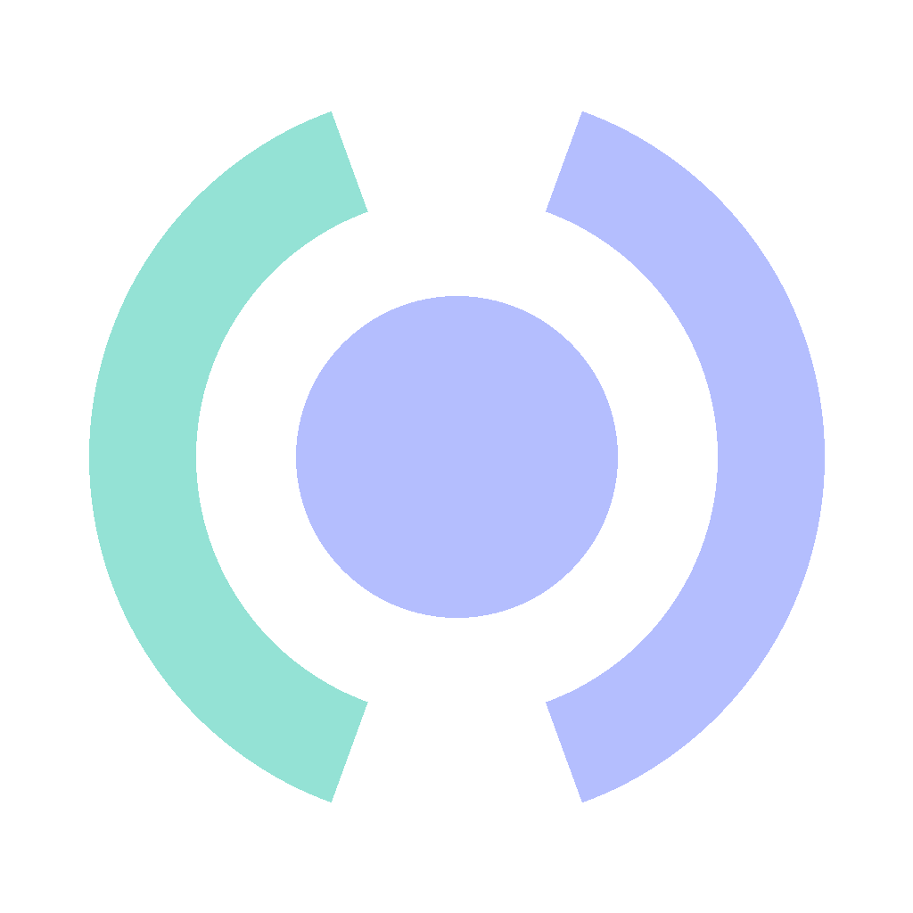

<div align="center">
  
  
  <h1>Clarity</h1>
  
  <p>
    <strong>Intelligent Code Correction & Refactoring Engine</strong>
  </p>

  <!-- Badges: Catppuccin Mocha Themed -->
  <p>
    
    
    
    
  </p>
</div>

---

## 🔮 Overview

## 📚 Documentation

Dive deeper into how Clarity works and how you can contribute:

*   **[AI Manifesto](docs/AI_MANIFESTO.md):** Our core philosophy, identity, and operating rules.
*   **[Architecture](docs/ARCHITECTURE.md):** System design and data flow.
*   **[Local Development](docs/LOCAL_DEVELOPMENT.md):** Guide to running Clarity on your machine.
*   **[Deployment Guide](docs/DEPLOYMENT_GUIDE.md):** How to deploy to Hugging Face and Vercel.
*   **[Git Concepts](docs/GIT_CONCEPTS.md):** Understanding our version control workflow.
*   **[Team & Projects](projects.md):** Meet the creators (Minor Project Team).

## Features

**Clarity** is an AI-powered code assistant designed to automatically detect bugs, suggest refactoring improvements, and enforce industry-standard naming conventions.

### ✨ Key Features
*   **Multi-Language Support:** Auto-detects and corrects **Python, C++, Java, and JavaScript**.
*   **Instant Feedback:** High-quality inference using the **Qwen 2.5 Coder 3B** model.
*   **Dual-Theme UI:** Professional dashboard available in **Catppuccin Mocha (Dark)** and **Latte (Light)**.
*   **Hybrid Deployment:** Run entirely locally (Docker) or connect to the Cloud backend out-of-the-box.

## 🏗️ Architecture

The system is containerized and composed of a decoupled frontend and inference engine.

```mermaid
%%{init: {'theme': 'dark', 'themeVariables': { 'darkMode': true, 'primaryColor': '#1e1e2e', 'edgeLabelBackground':'#181825', 'tertiaryColor': '#181825', 'mainBkg': '#1e1e2e', 'nodeBorder': '#b4befe', 'lineColor': '#cdd6f4'}}}%%
graph LR
    User[User] -->|Code Snippet| FE[Frontend (Nginx/HTML)];
    FE -->|REST API| API[FastAPI Gateway];
    API -->|Inference Request| Model[Transformer Model];
    Model -->|Corrected Code| API;
    API -->|JSON Response| FE;
    FE -->|Display| User;
    
    style User fill:#fab387,stroke:#fab387,color:#1e1e2e
    style FE fill:#94e2d5,stroke:#94e2d5,color:#1e1e2e
    style API fill:#b4befe,stroke:#b4befe,color:#1e1e2e
    style Model fill:#45475a,stroke:#cdd6f4,color:#cdd6f4
```

## 🚀 Quick Start

### 1. Instant Demo (Cloud Mode)
You don't need to install anything! The app defaults to **Cloud Mode**.
1.  Clone the repo: `git clone ...`
2.  Open `frontend/index.html` in your browser.
3.  Start coding immediately.

### 2. Docker Compose (Local Privacy)
Run the entire stack locally for zero-latency, private inference.

```bash
docker compose up --build
```
*   **Frontend:** `http://localhost:80`
*   **API Docs:** `http://localhost:8000/docs`

*Switch the toggle in the footer to **Docker** to connect.*

### 3. Manual Development

**Backend:**
```bash
cd backend
pip install -r requirements.txt
uvicorn main:app --reload
```

**Frontend:**
Serve the `frontend/` directory (e.g., `python -m http.server 3000`).
*Switch the toggle in the footer to **Local**.*

## 🛠️ Tech Stack

| Component | Technology | Description |
| :--- | :--- | :--- |
| **Frontend** | HTML5 / CSS3 / JS | Lightweight, vanilla implementation with **Mocha** styling |
| **API Gateway** | FastAPI | High-performance async Python framework |
| **Inference** | Transformers | High-performance AI Inference |
| **Serving** | Uvicorn / Nginx | Production-grade web servers |
| **DevOps** | Docker Compose | Multi-container orchestration |

## 📂 Repository Structure

```text
.
├── backend/                # FastAPI application & Model logic
│   ├── main.py             # API Entrypoint
│   └── model_service.py    # Inference logic & Language Detection
├── frontend/               # Static web assets
│   ├── index.html          # Main UI
│   ├── style.css           # Catppuccin Theme System
│   └── assets/             # Generated logos
├── generate_assets.py      # Procedural asset generator script
└── docker-compose.yml      # Orchestration config
```

## 🎨 Asset Generation

This project includes a procedural asset generator to ensure brand consistency.
```bash
python generate_assets.py
```
*Generates `frontend/assets/logo.png`.*

## 📜 License

Distributed under the MIT License.

---
<div align="center">
  <small>Designed with 💜 and ☕ (Catppuccin Mocha)</small>
</div>