<div align="center">
  
  
  <h1>Clarity</h1>
  
  <p>
    <strong>Intelligent Code Correction & Refactoring Engine</strong>
  </p>

  <!-- Badges: Catppuccin Mocha Themed -->
  <p>
    
    
    
    
  </p>
</div>

---

## 🔮 Overview

## 📚 Documentation

**For Team & Evaluators:**
*   **[📖 The Journey (Start Here)](JOURNEY.md):** The comprehensive story, team roster, timeline, and troubleshooting war stories.
*   **[🎓 College Artifacts](docs/college/README.md):** Synopsis and Presentation slides.

**For Students / Beginners:**
*   **[🧠 Zero-to-Hero Concepts](docs/archive/LEARNING_RESOURCES.md):** What is Docker? What is an API? The core concepts explained simply.

**For Developers:**
*   **[🛠️ Developer Manual](DEVELOPMENT.md):** Architecture, Local Setup, and Deployment Guide.
*   **[AI Manifesto](docs/AI_MANIFESTO.md):** Our core philosophy, identity, and operating rules.

## Features

**Clarity** is an AI-powered code assistant designed to automatically detect bugs, suggest refactoring improvements, and enforce industry-standard naming conventions.

### ✨ Key Features
*   **Multi-Language Support (20+):** Auto-detects and corrects major languages:
    <p>
      <!-- Row 1: The Giants -->
      
      
      
      
      
    </p>
    <p>
      <!-- Row 2: Systems & Modern -->
      
      
      
      
      
    </p>
    <p>
      <!-- Row 3: Web & Scripting -->
      
      
      
      
      
    </p>
    <p>
      <!-- Row 4: Functional & Others -->
      
      
      
      
    </p>

*   **Instant Feedback:** High-quality inference using the **Qwen 2.5 Coder 7B (GGUF)** model running on `llama.cpp`.
*   **Adaptive Theming:** Full **Catppuccin** support with 4 flavors:
    *   🌻 **Latte** (Light)
    *   🪴 **Frappé** (Soft Dark)
    *   🌺 **Macchiato** (Medium Dark)
    *   🌿 **Mocha** (Deep Dark)
    *   🖥️ **Auto-Switching** based on system preference.
*   **Professional UI:** Glassmorphism design with real-time Syntax Highlighting (Highlight.js) and Font Size controls.
*   **Hybrid Deployment:** Run entirely locally (Docker) or connect to the Cloud backend out-of-the-box.

## 🏗️ Architecture

The system is containerized and composed of a decoupled frontend and inference engine.

```mermaid
%%{init: {'theme': 'dark', 'themeVariables': { 'darkMode': true, 'primaryColor': '#1e1e2e', 'edgeLabelBackground':'#181825', 'tertiaryColor': '#181825', 'mainBkg': '#1e1e2e', 'nodeBorder': '#b4befe', 'lineColor': '#cdd6f4'}}}%%
graph LR
    User(User) -->|Code Snippet| FE["Frontend (Nginx/HTML)"]
    FE -->|REST API| API["FastAPI Gateway"]
    API -->|Inference Request| Engine["llama.cpp Engine"]
    Engine -->|Corrected Code| API
    API -->|JSON Response| FE
    FE -->|Display| User
    
    style User fill:#fab387,stroke:#fab387,color:#1e1e2e
    style FE fill:#94e2d5,stroke:#94e2d5,color:#1e1e2e
    style API fill:#b4befe,stroke:#b4befe,color:#1e1e2e
    style Engine fill:#45475a,stroke:#cdd6f4,color:#cdd6f4
```



## 🚀 Quick Start

### 1. Instant Demo (Cloud Mode)
You don't need to install anything! The app defaults to **Cloud Mode**.
1.  Clone the repo: `git clone ...`
2.  Open `frontend/index.html` in your browser.
3.  Start coding immediately.

### 2. Docker Compose (Local Privacy)
Run the entire stack locally for zero-latency, private inference.

```bash
docker compose up --build
```
*   **Frontend:** `http://localhost:80`
*   **API Docs:** `http://localhost:8000/docs`

*Switch the toggle in the footer to **Docker** to connect.*

### 3. Manual Development

**Backend:**
```bash
cd backend
pip install -r requirements.txt
uvicorn main:app --reload
```

**Frontend:**
Serve the `frontend/` directory (e.g., `python -m http.server 3000`).
*Switch the toggle in the footer to **Local**.*

## 🛠️ Tech Stack

| Component | Technology | Description |
| :--- | :--- | :--- |
| **Frontend** | HTML5 / CSS3 / JS | **Catppuccin** Themed UI with **Highlight.js** |
| **API Gateway** | FastAPI | High-performance async Python framework |
| **Inference** | llama-cpp-python | CPU-Optimized Inference (GGUF) |
| **Model** | Qwen 2.5 Coder 7B | State-of-the-art Coding LLM (4-bit) |
| **Serving** | Uvicorn / Nginx | Production-grade web servers |
| **DevOps** | Docker Compose | Multi-container orchestration |

## 📂 Repository Structure

```text
.
├── backend/                # FastAPI application & Model logic
│   ├── main.py             # API Entrypoint
│   └── model_service.py    # Inference logic & Language Detection
├── frontend/               # Static web assets
│   ├── index.html          # Main UI
│   ├── style.css           # Catppuccin Theme System
│   └── assets/             # Generated logos
├── generate_assets.py      # Procedural asset generator script
└── docker-compose.yml      # Orchestration config
```

## 🎨 Asset Generation

This project includes a procedural asset generator to ensure brand consistency.
```bash
python generate_assets.py
```
*Generates `frontend/assets/logo.png`.*

## 📜 License

Distributed under the MIT License.

---
<div align="center">
  <small>Designed with 💜 and ☕ (Catppuccin Mocha)</small>
</div>