# 🏗️ System Architecture

> "Design is not just what it looks like and feels like. Design is how it works."

Clarity follows a **Microservices** pattern, decoupling the heavy Inference Engine from the lightweight UI.

---

## 🧩 Component Map

```mermaid
%%{init: {'theme': 'dark', 'themeVariables': { 'darkMode': true, 'primaryColor': '#1e1e2e', 'edgeLabelBackground':'#181825', 'tertiaryColor': '#181825', 'mainBkg': '#1e1e2e', 'nodeBorder': '#b4befe', 'lineColor': '#cdd6f4'}}}%%
graph TD
    subgraph Client [Frontend Layer]
        UI[Browser UI]
        Theme[Theme Engine]
        HLJS[Syntax Highlighter]
    end

    subgraph Server [Backend Layer]
        API[FastAPI Gateway]
        Detect[Lang Detection]
        Llama[llama.cpp Engine]
    end

    UI -->|JSON HTTP| API
    API -->|Raw Code| Detect
    API -->|Prompt| Llama
    Llama -->|Tokens| API
    
    style Client fill:#313244,stroke:#89b4fa,color:#cdd6f4
    style Server fill:#313244,stroke:#a6e3a1,color:#cdd6f4
    style UI fill:#45475a,stroke:#b4befe
    style API fill:#45475a,stroke:#94e2d5
    style Llama fill:#45475a,stroke:#f38ba8
```

## 🧠 Core Systems

### 1. The Inference Engine (`backend/model_service.py`)
*   **Technology:** `llama-cpp-python` bindings for `llama.cpp`.
*   **Model:** Qwen 2.5 Coder 7B (GGUF Quantized).
*   **Optimization:** Runs on CPU with **4-bit quantization** to fit within 16GB RAM constraints.
*   **Context:** Dynamic context window (`n_ctx`) of 4096 or 8192 tokens depending on environment.

### 2. The Frontend (`frontend/`)
*   **Philosophy:** Zero-build. Vanilla HTML/JS/CSS.
*   **Theming:** A custom **Catppuccin Theme Engine** supports 4 variants (Latte, Frappé, Macchiato, Mocha) with real-time OS synchronization.
*   **Editor:** Custom glassmorphism pane with **Highlight.js** integration for 20+ languages.

### 3. Smart Discovery
The frontend automatically detects where it is running:
*   **Local Mode:** Connects to `localhost:8000`.
*   **Docker Mode:** Connects to the internal container network.
*   **Cloud Mode:** Connects to the Hugging Face Space URL.

---

## 🔗 Related Documentation
*   **[Deployment Guide](DEPLOYMENT_GUIDE.md):** How we ship this architecture.
*   **[Troubleshooting](TROUBLESHOOTING.md):** Architectural decisions made to fix crashes.
*   **[Local Development](LOCAL_DEVELOPMENT.md):** Running the stack.
